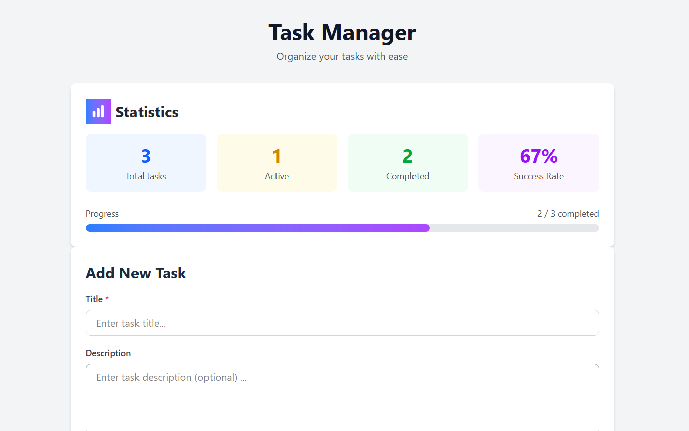
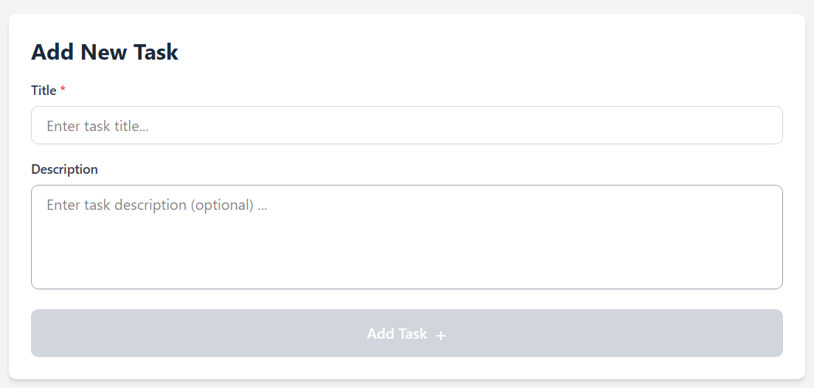
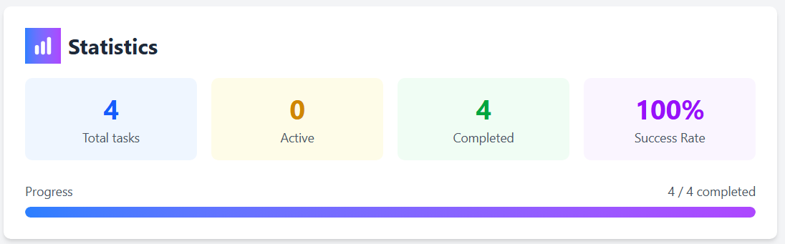
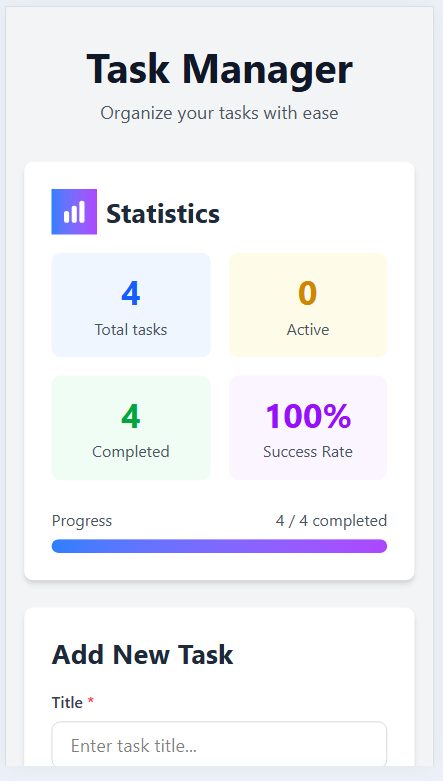

# Task Manager

A modern, responsive task management application built with Angular 21 and TypeScript. Features real-time updates using Angular Signals, local storage persistence, and a clean, intuitive user interface.



## Features
- **Create Tasks** - Add tasks with title and description
- **Mark Complete** - Toggle task completion status
- **Delete Tasks** - Remove tasks you no longer need
- **Filter Views** - View all, active, or completed tasks
- **Real-time Stats** - Track progress with live statistics
- **Persistent Storage** - Tasks saved locally (survives page refresh)
- **Responsive Design** - Works on mobile, tablet, and desktop
- **Modern UI** - Clean interface with smooth animations

## Live Demo
**[View Live Application](https://modern-angular-task-manager.vercel.app/)**

## Screenshots
### Main Interface


### Task Statistics


### Mobile View


## Project Showcase

### Problem Solved
Managing daily tasks efficiently without a backend dependency.

### Solution Delivered
A fast, responsive task manager using modern Angular features with local data persistence.

### Technical Highlights
- **Angular Signals** for reactive state (cutting-edge feature)
- **Standalone Components** (modern Angular architecture)
- **Immutable state updates** (predictable data flow)
- **Computed values** (optimized performance)
- **Responsive design** (mobile-first approach)

### Results
- Fast load time
- Fully responsive (mobile to desktop)
- Automatic persistence (no data loss)
- Clean, intuitive UI

## Technologies Used
- **Angular 21** - Modern web framework
- **TypeScript** - Type-safe JavaScript
- **Angular Signals** - Reactive state management
- **TailwindCSS** - Utility-first CSS framework
- **LocalStorage API** - Client-side data persistence
- **Standalone Components** - Modern Angular architecture

## Project Structure
```
src/
|___app/
|   |___components/
|   |   |___task-form/            # Form to add tasks
|   |   |___task-list/            # Display list of tasks
|   |   |___task-filters/         # Filter buttons (All/Active/Completed)
|   |   |___task-stats/           # Statistics dashboard
|   |___services/
|   |   |___task.service.ts       # Centralized state management
|   |___models/
|   |   |___task.model.ts         # Typescript interfaces
|   |___app.ts                    # Root component
|___styles.css                    # Global styles
|___index.html                    # Entry point
```

## Architecture Highlights
- **Signal-based State Management** - Modern reactive approach using Angular Signals
- **Smart/Dumb Component Pattern** - Clear Separation of concerns
- **Immutable Updates** - Predictable state changes
- **Service Layer** - Centralized business logic
- **LocalStorage Persistence** - Automatic save/load

**[Read detailed architecture documentation](./ARCHITECTURE.md)**

## Getting Started

### Prerequisites

- Node.js (v18 or higher)
- npm or yarn

### Installation

```bash
# Clone repository
git clone https://github.com/ejercan/task-manager-modern-angular.git
cd task-manager-ng17

# Install dependencies
npm install

# Start development server
ng serve

# Open browser
# Navigate to http://localhost:4200
```

### Build for production

```bash
# Create production build
ng build

# Output will be in dist/ folder
```

## Usage

1. **Add a Task** - Enter title and description, click "Add Task"
2. **Complete a Task** - Click the checkbox to mark as complete
3. **Delete a Task** - Click the delete button
4. **Filter Tasks** - Use All/Active/Completed buttons to filter
5. **Track Progress** - View statistics at the top of the page

## Key Learning Outcomes

This project demonstrates:
- Modern Angular features (Signals, Standalone Components)
- TypeScript best practices
- Component-based architecture
- State management patterns
- Responsive design principles
- Data persistence strategies
- Clean code and documentation

## Future Enhancements

- [ ] Add task categories / tags
- [ ] Implement due dates with reminders
- [ ] Add task priority levels
- [ ] Drag-and-drop task reordering
- [ ] Backend API integration
- [ ] User authentication
- [ ] Dark mode toggle
- [ ] Export / import tasks (JSON / CSV)
- [ ] Add end-to-end tests

## Author

**Eugen Jercan**

- GitHub: [@ejercan](https://github.com/ejercan)

## License

This project is open source and available under [MIT License](https://opensource.org/license/mit)
